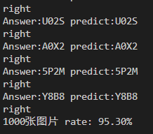

# Resnet50-for-captche
基于Resnet50的四位验证码识别

通过运行对应语句安装环境
```
pip install -r requriements.txt
```
请先进入./MY_GEN编辑gen_captcha.py
分别修改main函数中的path和num
训练集图路径为 
```
path = "./images/train"
```
验证集图路径为
```
path = "./images/test"
```

根据需求设置num，设置好训练集和验证集图片数量
回到项目最外层路径
```
python ./model_training.py 
```
进行模型训练(代码中epoch为50)

<font color=red>注意：在预测前请在"test"文件夹中生成用于测试的验证码</font>
最后通过
```
python ./model_predict.py
```
进行预测
结果如下：



感谢:
基础代码修改自[captcha-resnet50-classifier](https://www.kaggle.com/code/johnbergmann/captcha-resnet50-classifier/notebook)
